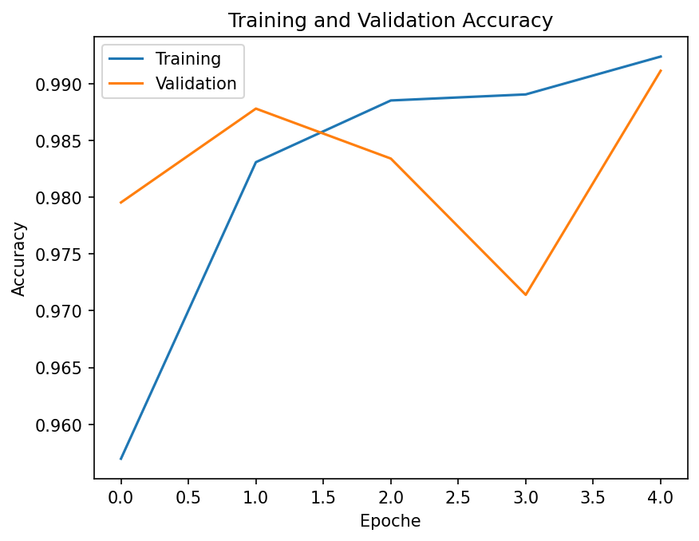
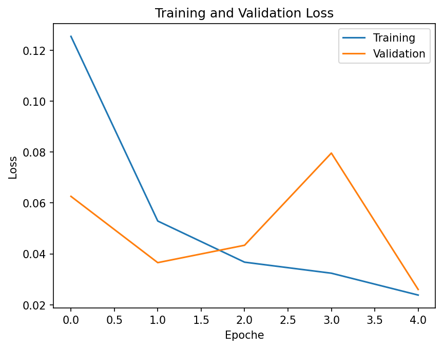
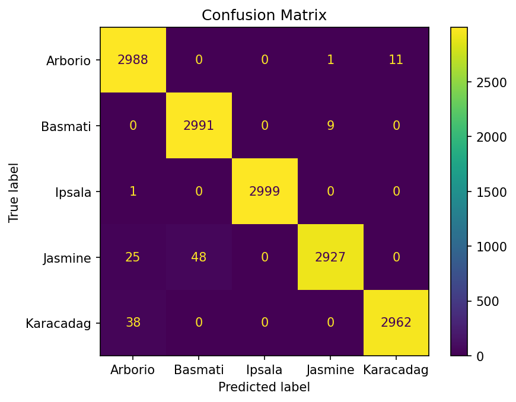

# Rice Image Classification with CNN

## Overview

Deep Learning project for the classification of five rice varieties using a Convolutional Neural Network (CNN) built with TensorFlow/Keras.

The model classifies rice images into the following five categories:

- Arborio
- Basmati
- Ipsala
- Jasmine
- Karacadag

## Dataset

The Rice Image Dataset contains images belonging to five different rice varieties.

In this project, 74,999 images were successfully loaded and processed.

## Preprocessing

The images were:

- Resized to 128×128 pixels
- Processed as RGB images
- Converted into NumPy arrays

The dataset was divided into training and test sets using an 80/20 split with stratification.

## CNN Architecture

The model consists of:

- Rescaling (1/255)
- Conv2D — 32 filters
- MaxPooling2D
- Conv2D — 64 filters
- MaxPooling2D
- Flatten
- Dense — 5 output classes with Softmax activation

## Training

The model was trained for 5 epochs using:

- Optimizer: Adam
- Loss: Sparse Categorical Crossentropy
- Metric: Accuracy
- Batch size: 32

## Results

The model achieved the following results on the test set:

- **Test Accuracy: 99.42%**
- **Test Loss: 0.018**

## Results Visualization

### Accuracy



### Loss



### Confusion Matrix



## Technologies

- Python
- TensorFlow
- Keras
- NumPy
- Matplotlib
- Scikit-learn

## Project Structure

```text
Rice-Image-Classification-CNN/
│
├── riso.ipynb
├── README.md
│
└── images/
    ├── accuracy.png
    ├── loss.png
    └── confusion_matrix.png
